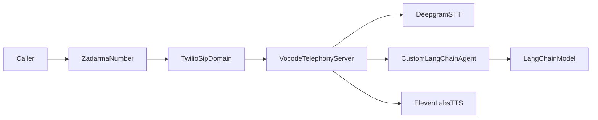

# Vocode-Based AI Contact Center

This project replaces a `Zadarma -> Twilio SIP Domain -> Dialogflow` voice path with a self-hosted
Vocode telephony app that keeps Twilio for inbound calls, uses Deepgram for STT,
ElevenLabs for TTS, and a custom LangChain-powered agent for the conversation layer.

## What This Includes

- FastAPI app with Vocode `TelephonyServer`
- `/inbound_call` webhook for Twilio voice traffic
- ElevenLabs telephone-output synthesizer config
- Custom LangChain-backed Vocode agent
- Redis-backed call config storage using Vocode's `RedisConfigManager`
- Health endpoint so you can verify the app is running before wiring telephony

## Architecture



## 1. Install

Use Python `3.11` for the current Vocode dependency stack on Windows.

```powershell
py -3.11 -m venv .venv
.\.venv\Scripts\Activate.ps1
python -m pip install --upgrade pip
pip install -r requirements.txt
```

## 2. Start Redis

Install `ffmpeg` once on the machine if it is not already available:

```powershell
winget install -e --id Gyan.FFmpeg.Essentials
```

If you have Docker available:

```powershell
docker compose up -d redis
```

If you already run Redis elsewhere, point `REDISHOST` and related variables at that instance.

## 3. Configure Environment

Copy `.env.example` to `.env` and fill in:

- `TWILIO_ACCOUNT_SID`
- `TWILIO_AUTH_TOKEN`
- `TWILIO_SIP_DOMAIN`
- `DEEPGRAM_API_KEY`
- `ELEVENLABS_API_KEY`
- `ELEVENLABS_VOICE_ID`
- `OPENAI_API_KEY` if `LANGCHAIN_PROVIDER=openai`

Note: Vocode's documented transcribers do not include ElevenLabs STT, so this project keeps
`Deepgram` for speech-to-text and `ElevenLabs` for speech synthesis.

For local development, either:

- set `BASE_URL` to your public host, or
- leave `BASE_URL` empty and provide `NGROK_AUTH_TOKEN` so the app can open a tunnel
- on Railway, `RAILWAY_PUBLIC_DOMAIN` can provide the public host automatically

Optional:

- set `TRANSFER_PHONE_NUMBER` if you want to reserve a value for future live transfer logic
- set `REDIS_URL` if your platform provides Redis as a single connection string
- set `SMS_ADAPTER_MODE=twilio` to enable real outbound Twilio messaging
- set `TWILIO_MESSAGE_CHANNEL=whatsapp` and `TWILIO_WHATSAPP_FROM_NUMBER=+14155238886` to test with the Twilio WhatsApp Sandbox, or use your approved WhatsApp sender number in production
- set `NLTK_AUTO_DOWNLOAD=true` only for local/dev environments where startup downloads are acceptable; on Railway the app now avoids NLTK downloads by default to reduce Twilio webhook cold-start failures
- set `INFORMATION_PRODUCTS_PDF_PATH` to a local PDF file, or `INFORMATION_PRODUCTS_PDF_URL` to a hosted PDF, if you want the LangGraph information flow to answer product questions from that document
- set `INFORMATION_PRODUCTS_ANSWER_LANGUAGE` to the language you want spoken back to callers from product-PDF answers; for an English ElevenLabs voice, keep this as `English` even if the PDF itself is in Greek

## 4. Run The App

```powershell
.\.venv\Scripts\Activate.ps1
uvicorn main:app --host 0.0.0.0 --port 3000
```

Check health:

```powershell
Invoke-WebRequest http://127.0.0.1:3000/healthz
```

If the app has all required credentials, `healthz` reports `ok` and the app mounts `/inbound_call`.
If anything is missing, `healthz` reports `degraded` with the missing configuration names.
When the app is reachable publicly, `healthz` also shows the exact `inbound_call_url` to paste into Twilio.

## 5. Point Twilio At Vocode

Once the app is reachable over HTTPS:

1. In Twilio, open your SIP Domain, such as `voiceagentpapas.sip.twilio.com`
2. Under `Call Control Configuration` for incoming SIP calls, set the request URL to:

```text
https://YOUR-PUBLIC-HOST/inbound_call
```

3. Set the method to `HTTP POST`
4. Save the SIP Domain configuration

Keep the Zadarma routing pointed at the same Twilio SIP Domain during rollout.

## 6. Deploy On Railway

This project includes Railway-friendly files:

- `nixpacks.toml` to install `ffmpeg` and `portaudio`
- `railway.json` with the `uvicorn` start command
- `.python-version` pinned to `3.11`
- `runtime.txt` pinned to `3.11`

Recommended Railway setup:

1. Create a new Railway project from this folder or from a Git repo.
2. Add a Redis service.
3. In your app service variables, set:

```text
TWILIO_ACCOUNT_SID=...
TWILIO_AUTH_TOKEN=...
TWILIO_SIP_DOMAIN=voiceagentpapas.sip.twilio.com
DEEPGRAM_API_KEY=...
ELEVENLABS_API_KEY=...
ELEVENLABS_VOICE_ID=...
OPENAI_API_KEY=...
```

Also set this Railway variable explicitly to avoid Python `3.13` builds:

```text
NIXPACKS_PYTHON_VERSION=3.11
```

4. Either:

- map Railway Redis values into `REDISHOST` / `REDISPORT` / `REDISUSER` / `REDISPASSWORD`, or
- set a single `REDIS_URL` if your Railway Redis plugin exposes one

5. Deploy the app.
6. After deployment, open:

```text
https://YOUR-RAILWAY-DOMAIN/healthz
```

7. Copy the `inbound_call_url` value from the JSON response into the Twilio SIP Domain `Call Control Configuration`.

## 7. Keep Zadarma During Migration

Recommended migration path:

1. Keep the public Zadarma number unchanged
2. Continue routing Zadarma calls into the Twilio SIP Domain
3. Move the Twilio SIP Domain incoming webhook from Dialogflow to this Vocode app
4. Test live calls
5. Only remove legacy Dialogflow wiring after the new flow is stable

## 8. Customizing The Agent

The custom agent lives in `src/vocode_contact_center/agent.py`.

You can tune:

- the initial greeting in `.env`
- the system prompt in `src/vocode_contact_center/prompts.py`
- the model/provider in `.env`

If you want CRM tools, RAG, appointment booking, or human escalation, extend the
LangChain pipeline in `src/vocode_contact_center/langchain_support.py`.

The information flow can now answer product questions directly from a configured PDF.
Point `INFORMATION_PRODUCTS_PDF_PATH` at a local file or `INFORMATION_PRODUCTS_PDF_URL`
at a public PDF, then callers can choose `products` and ask follow-up product questions.
If the PDF is Greek but your TTS voice is English, set `INFORMATION_PRODUCTS_ANSWER_LANGUAGE=English`
so the LLM translates the answer before it reaches ElevenLabs. If you want Greek audio output instead,
use a multilingual Greek-capable ElevenLabs voice and set the answer language to `Greek`.

## 9. Current Limitations

- This scaffold does not auto-configure your Twilio or Zadarma accounts because those require your credentials.
- Full live call validation still depends on real provider keys and a public HTTPS endpoint.
- Human handoff logic is prepared at the app level, but your exact business workflow still needs tool integrations.

See `VALIDATION.md` for the rollout and live-call test checklist.
