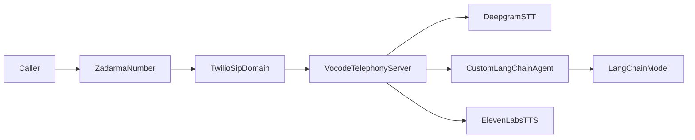

# PeopleCert voice contact center (Vocode)

This project hosts **CertyPal**, PeopleCert’s AI voice assistant on a telephony path: inbound calls via Twilio SIP, Deepgram for speech-to-text, ElevenLabs for speech synthesis, and a LangChain-powered layer with optional LangGraph structured flows.

Behavior and scope are aligned with PeopleCert candidate support (B&IT certifications, online proctored and classroom exams). Configure prompts in `src/vocode_contact_center/prompts.py` and the initial greeting via `.env`.

## What this includes

- FastAPI app with Vocode `TelephonyServer`
- `/inbound_call` webhook for Twilio voice traffic
- ElevenLabs telephone-output synthesizer config
- Custom LangChain-backed Vocode agent (hybrid router + LangGraph)
- Redis-backed call config using Vocode’s `RedisConfigManager`
- Health endpoint to verify the app before wiring telephony
- Optional PDF-backed answers in the information flow (`INFORMATION_PRODUCTS_*`)

## Architecture



## 1. Install

Use Python `3.11` for the current Vocode dependency stack on Windows.

```powershell
py -3.11 -m venv .venv
.\.venv\Scripts\Activate.ps1
python -m pip install --upgrade pip
pip install -r requirements.txt
```

## 2. Start Redis

Install `ffmpeg` once on the machine if it is not already available:

```powershell
winget install -e --id Gyan.FFmpeg.Essentials
```

If you have Docker available:

```powershell
docker compose up -d redis
```

If you already run Redis elsewhere, point `REDISHOST` and related variables at that instance.

## 3. Configure environment

Copy `.env.example` to `.env` and fill in:

- `TWILIO_ACCOUNT_SID`
- `TWILIO_AUTH_TOKEN`
- `TWILIO_SIP_DOMAIN`
- `DEEPGRAM_API_KEY`
- `ELEVENLABS_API_KEY`
- `ELEVENLABS_VOICE_ID`
- Provider key for `LANGCHAIN_PROVIDER` (e.g. `GROQ_API_KEY`)

Note: Vocode’s documented transcribers do not include ElevenLabs STT, so this project keeps Deepgram for speech-to-text and ElevenLabs for synthesis.

For local development, either:

- set `BASE_URL` to your public host, or
- leave `BASE_URL` empty and provide `NGROK_AUTH_TOKEN` so the app can open a tunnel
- on Railway, `RAILWAY_PUBLIC_DOMAIN` can provide the public host automatically

PeopleCert-specific optional variables:

- `AGENT_NAME` / `AGENT_INITIAL_MESSAGE` to override the default CertyPal opening
- `INFORMATION_STORE_WEBSITE_URL` — primary peoplecert.org landing (default in code is `https://www.peoplecert.org`)
- `INFORMATION_PRODUCTS_PDF_PATH` or `INFORMATION_PRODUCTS_PDF_URL` — **approved** PeopleCert help or policy PDF for document-backed answers (leave empty until you have an allowed URL or file)
- `INFORMATION_PRODUCTS_ANSWER_LANGUAGE` — for skillset `Candidate_BIT_OLP_EN`, use `English` with an English TTS voice

Other optional settings:

- `TRANSFER_PHONE_NUMBER` for human handoff when your telephony flow uses it
- `REDIS_URL` if your platform provides Redis as a single connection string
- `SMS_ADAPTER_MODE=twilio` for real outbound Twilio messaging (registration confirmation flows)
- `NLTK_AUTO_DOWNLOAD=true` only for local/dev where startup downloads are acceptable

## 4. Run the app

```powershell
.\.venv\Scripts\Activate.ps1
uvicorn main:app --host 0.0.0.0 --port 3000
```

Check health:

```powershell
Invoke-WebRequest http://127.0.0.1:3000/healthz
```

If the app has all required credentials, `healthz` reports `ok` and the app mounts `/inbound_call`. When the app is reachable publicly, `healthz` shows the `inbound_call_url` to paste into Twilio.

## 5. Point Twilio at Vocode

Once the app is reachable over HTTPS:

1. In Twilio, open your SIP Domain.
2. Under **Call Control Configuration** for incoming SIP calls, set the request URL to:

```text
https://YOUR-PUBLIC-HOST/inbound_call
```

3. Set the method to **HTTP POST** and save.

## 6. Deploy on Railway

This project includes Railway-friendly files (`nixpacks.toml`, `railway.json`, `.python-version`, `runtime.txt`). Set `NIXPACKS_PYTHON_VERSION=3.11`, add Redis, and configure the same Twilio, Deepgram, ElevenLabs, and LangChain variables as locally. After deploy, copy `inbound_call_url` from `https://YOUR-RAILWAY-DOMAIN/healthz` into the Twilio SIP domain webhook.

## 7. Customizing CertyPal

- **System prompt and rules:** `src/vocode_contact_center/prompts.py`
- **Greeting and display name:** `.env` (`AGENT_INITIAL_MESSAGE`, `AGENT_NAME`) or defaults in `src/vocode_contact_center/settings.py`
- **Hybrid router (graph vs generic):** `src/vocode_contact_center/orchestration/hybrid_service.py`
- **Structured menus and flows:** `src/vocode_contact_center/voicebot_graph/`
- **RAG-style PDF answers:** `src/vocode_contact_center/product_knowledge.py` plus `INFORMATION_PRODUCTS_*`

Extend tools or CRM integrations via `src/vocode_contact_center/langchain_support.py` and the agent factory as needed.

## 8. Limitations

- Twilio and carrier setup require your own credentials and a public HTTPS endpoint.
- Human handoff depends on `TRANSFER_PHONE_NUMBER`, Genesys adapters, or your own telephony wiring.
- Document answers only cover what is in the configured PDF; do not rely on the model to invent PeopleCert policy.

See `VALIDATION.md` for rollout and live-call checks.
