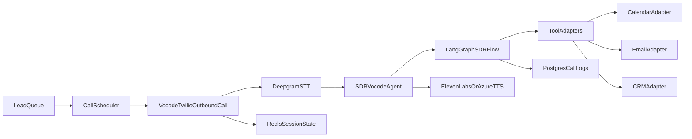

# AI SDR Voice Agent

This project runs an outbound AI SDR that follows up with prospects by phone, qualifies them, books meetings, and sends follow-up emails after the call. It uses Vocode for telephony, LangGraph for conversation control flow, LangChain-style tools behind adapter interfaces, Redis for active-call telephony config, and provider-agnostic stub integrations for early development.

## What this includes

- FastAPI app with health, lead, session, and outbound call endpoints
- LangGraph SDR conversation flow under `src/ai_sdr_agent/graph/`
- Vocode agent bridge in `src/ai_sdr_agent/vocode_agent.py`
- Stub calendar, email, CRM, and persistence adapters for local testing
- Outbound call scheduling via Twilio + Deepgram + ElevenLabs/Azure
- Follow-up email templating in `templates/follow_up_email.html`

## Architecture



## Install

Use Python `3.11`.

```powershell
py -3.11 -m venv .venv
.\.venv\Scripts\Activate.ps1
python -m pip install --upgrade pip
pip install -r requirements.txt
```

If you need Redis locally:

```powershell
docker compose up -d redis
```

## Configure

Copy `.env.example` to `.env`.

Minimum fields for local stub-only graph testing:

- `LLM_PROVIDER=stub`
- `USE_STUB_INTEGRATIONS=true`

Minimum fields for real outbound telephony:

- `BASE_URL`
- `TWILIO_ACCOUNT_SID`
- `TWILIO_AUTH_TOKEN`
- `TWILIO_PHONE_NUMBER`
- `DEEPGRAM_API_KEY`
- `ELEVENLABS_API_KEY` and `ELEVENLABS_VOICE_ID`, or Azure speech settings

Optional provider fields are included for later Google Calendar, email, and CRM integrations.

## Run

```powershell
.\.venv\Scripts\Activate.ps1
uvicorn main:app --host 0.0.0.0 --port 3000
```

## Local validation flow

1. Check health:

```powershell
Invoke-WebRequest http://127.0.0.1:3000/healthz
```

2. Inspect the seeded test lead:

```powershell
Invoke-WebRequest http://127.0.0.1:3000/leads
```

3. Start a graph session without telephony:

```powershell
Invoke-WebRequest -Method POST http://127.0.0.1:3000/sessions -ContentType "application/json" -Body '{"lead_id":"lead-001"}'
```

4. Continue the conversation:

```powershell
Invoke-WebRequest -Method POST http://127.0.0.1:3000/sessions/CONVERSATION_ID/turns -ContentType "application/json" -Body '{"human_input":"Yes, I oversee sales operations."}'
```

5. When telephony credentials are configured, trigger an outbound call:

```powershell
Invoke-WebRequest -Method POST http://127.0.0.1:3000/outbound/calls -ContentType "application/json" -Body '{"lead_id":"lead-001"}'
```

## Key directories

- `src/ai_sdr_agent/app.py`: FastAPI app and runtime wiring
- `src/ai_sdr_agent/graph/`: state, prompts, routers, nodes, and graph
- `src/ai_sdr_agent/tools/`: provider-agnostic calendar, email, and CRM tool adapters
- `src/ai_sdr_agent/services/`: pre-call loading, persistence, brain abstraction, and call scheduling
- `templates/follow_up_email.html`: email template used after qualifying calls

## Current limitations

- External integrations are stub-first; Google Calendar, SendGrid/SMTP, CRM, and Postgres adapters are not yet implemented against live providers.
- The seeded lead repository and call log store are in-memory for now.
- The Vocode path is wired for outbound use, but production rollout still needs real provider credentials and live call validation.

See `VALIDATION.md` for the SDR-specific rollout checklist.
